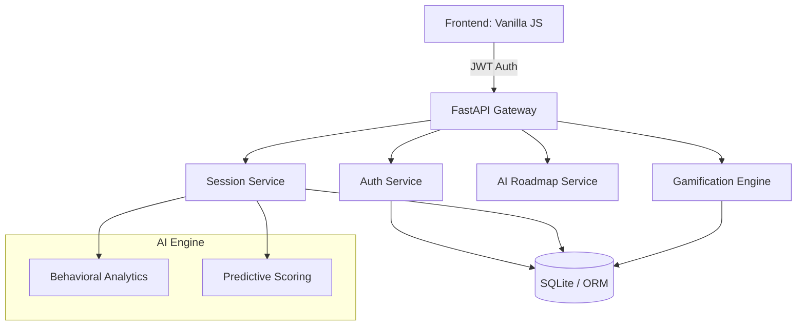

# NeuroStudy AI v2.0 | Technical Documentation

## 1. Architecture Overview (Clean Architecture)
NeuroStudy v2.0 follows a modular, service-oriented architecture designed for scalability and production-readiness.

## 2. API Endpoints List
| Method | Endpoint | Description | Auth Required |
| --- | --- | --- | --- |
| POST | `/api/auth/register` | User ID creation | No |
| POST | `/api/auth/login` | JWT Token generation | No |
| GET | `/api/sessions/` | Retrieve user sessions | Yes |
| POST | `/api/sessions/` | Log study session + Gain XP | Yes |
| GET | `/api/sessions/analysis` | Cognitive analytics + Weak subjects | Yes |
| POST | `/api/roadmap/generate` | AI interval-based timetable | Yes |
| GET | `/api/chat` | AI Neural Consultation | Yes |

## 3. Database Schema
### Users Table
- `id`: PK
- `username`: Unique Index
- `email`: Unique Index
- `hashed_password`: Bcrypt
- `xp`: Total experience
- `level`: Current rank

### Study Sessions Table
- `id`: PK
- `user_id`: FK
- `subject`: Index
- `duration_minutes`: Int
- `focus_rating`: Int (1-10)
- `timestamp`: UTC DateTime

## 4. Key Academic Features
- **Isolated Neural Data:** Each user has an isolated academic profile.
- **Productivity Vector Pricing:** Weighted focus scores based on time spent.
- **Cognitive Heatmap:** Visual proof of study consistency and persistence.
- **AI Neural Chat:** Real-time strategy adjustment through conversational AI.

## 5. Future Scope
- **Voice Integration:** Direct session logging via NLP voice commands.
- **Multi-node Sync:** Cloud migration to PostgreSQL and Redis for real-time leaderboards.
- **Collaborative Flow:** Peer-to-peer focus sessions with shared milestones.
